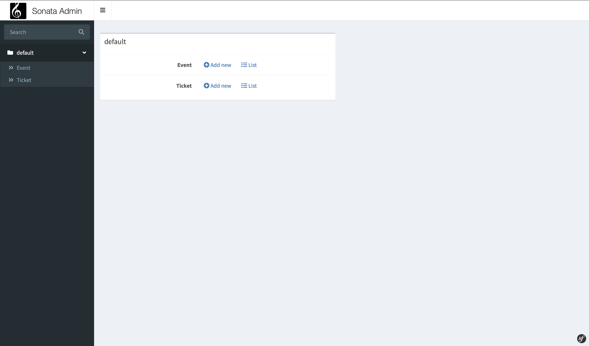
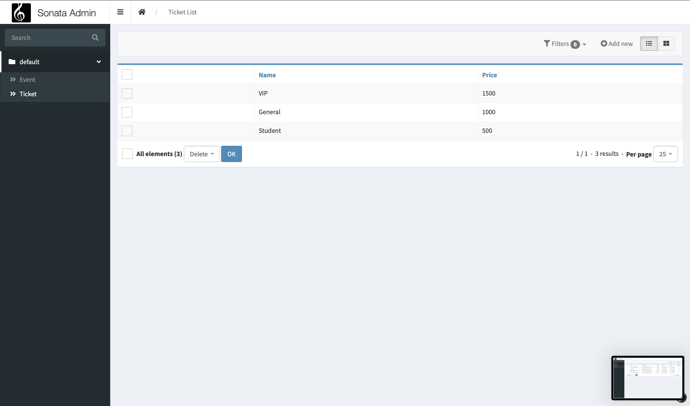
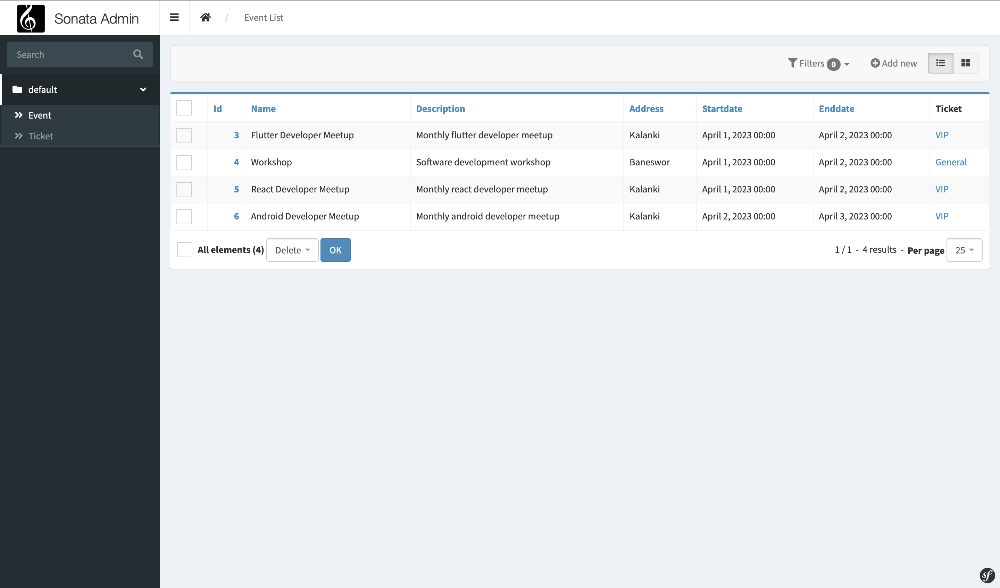
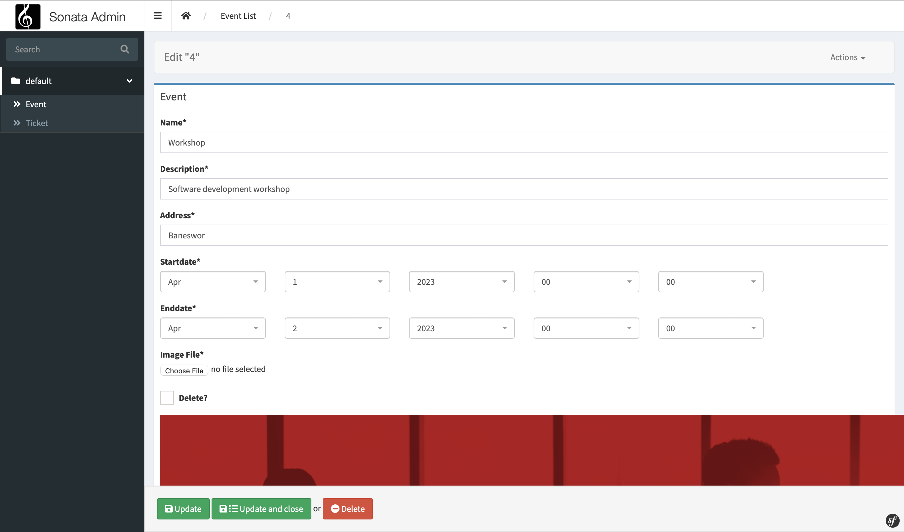

# event_management

A minimal backend service written in PHP with Symfony that lets you create events and exposes REST API that can be used to view event details.


# Screenshots

<div class="row">
</img>
</img>
</img>
</img>

</div>

# How to use
Make sure you have all the required tools that is used basic symfony project. Please read and follow the [official documentation](https://symfony.com/doc/current/setup.html)

## Step 1:

Clone this repository

```
git clone git@github.com:sharmashashi/event_management.git
```


## Step 2:

Goto the project root and get the dependencies

```
cd event_management && composer install
```


## Step 3:

Start your mysql server, create database and make migrations.

```
symfony console doctrine:database:create
symfony console make:migration
symfony console doctrine:migrations:migrate
```


## Step 4:

Start development server and get admin dashboard at `https://localhost:8000/admin/dashboard`

```
symfony serve
```
